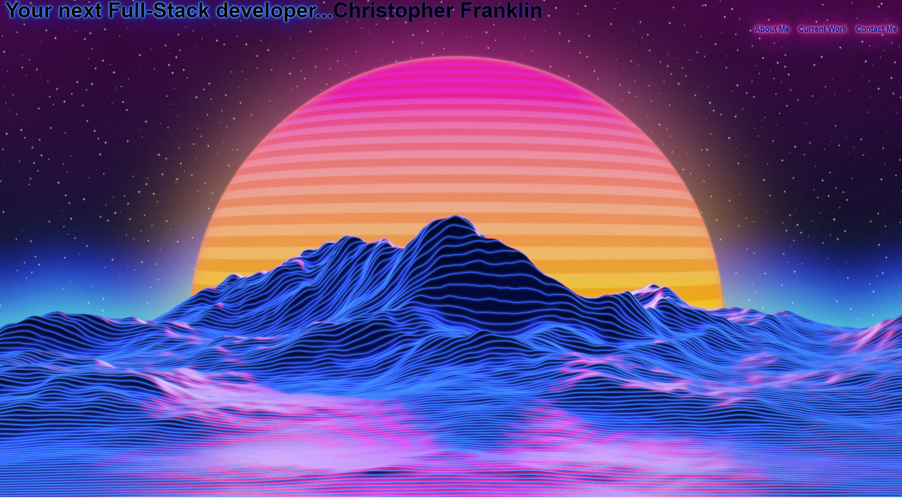

# SilverSSSC.github.io
The personal portfolio of Chris Franklin

## Live Deployment

https://silversssc.github.io/

## Installation

Use git clone to clone this repository to your local drive

'''bash
git clone "insert repo"
'''

## References
Background image: https://www.wallpaperflare.com/search?wallpaper=vaporwave
Blur background source code: https://webdesign.tutsplus.com/tutorials/how-to-create-a-frosted-glass-effect-in-css--cms-32535
Neon Text and animantion code: https://css-tricks.com/how-to-create-neon-text-with-css/

## Contributing
Pull requests are welcome. For major changes, please open an issue first to discuss what you would like to change.

Please make sure to update tests as appropriate.

## License
[MIT](https://choosealicense.com/licenses/mit/)
